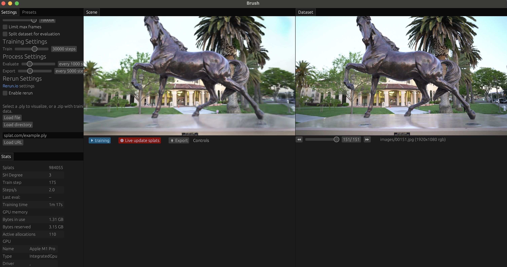

# 3D Reconstruction with Colmap



## Overview

These outputs provide the geometric foundation for 3D Gaussian Splatting systems like [Brush](https://github.com/ArthurBrussee/brush). It resizes images in a specified workspace directory and saves the resized images in a new folder while preserving the original images in a separate backup folder. It supports multiple scaling options and ensures that images are properly handled before processing. This also works on MacOS.

## Features

- **Preserves original images**

- **Supports various scaling options**:

  - **No Scaling** → Uses original images without modification.
  - **Half** → Reduces the image size by 50%.
  - **Quarter** → Reduces the image size by 75%.
  - **Eighth** → Reduces the image size by 87.5%.
  - **1600k** → Ensures the longest dimension of the image does not exceed 1600 pixels while maintaining aspect ratio.

## Installation

### ** Install Dependencies**

Make sure you have Python installed (>=3.8). Then, install the required dependencies:

```bash
pip install -r requirements.txt
```

## Usage

Run the script and pass the workspace path with images or a video along with the desired scaling option.

## Using This for 3D Gaussian Splatting

This script can be used to preprocess images for 3D Gaussian Splatting with [Brush](https://github.com/ArthurBrussee/brush).
